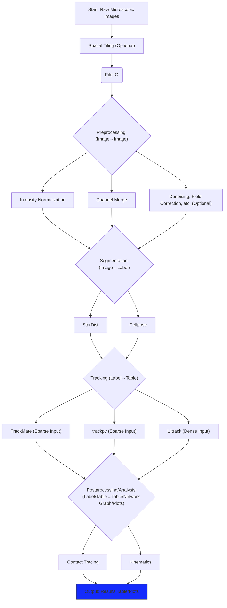

# Python Cytotoxicity Pipeline (pyCyto)

**pyCyto** is a flexible and extensible Python-based workflow package designed for analyzing microscopic cytotoxicity assays. It enables researchers and bioimage analysts to build reproducible analysis pipelines using simple YAML configuration files. Key features include support for multi-channel images, integration with Dask for parallel processing, and a modular design covering preprocessing, segmentation, tracking, and postprocessing analysis.

## Processing Pipeline Overview

The following diagram illustrates the typical workflow stages within pyCyto:



## Detailed Pipeline Steps & Features
- File IO
  - [x] Multi-channel image handling pipeline
  - [x] Dask implementation 
  - [ ] OME ZARR IO

- Preprocessing
  - [ ] Decovolution
  - [ ] Flat field correction 
  - [ ] Denoising
  - [ ] Gamma correction
  - [x] Intensity normalization
  - [ ] Pixel size normalization
  - [x] Channel merge
  - [x] Cross channel pixel correlation

- Segmentation
  
  Detection masks and cell centroids are expect to be in trackpy compatible format
  - [ ] Simple thresholding
  - [ ] Otsu thresholding
  - [x] StarDist
  - [x] Cellpose
  - [ ] Morphological operations
  - [x] Connected components 
- Tracking
  - [x] Dense to sparse
  - [x] Feature measurements
  - [ ] trackpy
  - [x] TrackMate (pyImageJ integration, script based automation, with user provided centroids/segmentation masks)
  - [ ] ultrack
- Contact Tracing
  - [ ] Number of contacts (same cell type/ different cell types)
  - [ ] Contact time measurements
  - [ ] Number of cell killing
  - [ ] Cell death event
  - [ ] Which cell(s) are interaction
  - [ ] Pandas/CSV export in trackpy format
  - [ ] Displacement, velocity
  - [ ] Analysis plots
 
The result Pandas table should take the following format:
| Id | Track | x | y | z | t | alive | vel_x | vel_z | vel_y | contact_same | contact_diff | contact_same_id | contacting_diff_id |
|:--:|:-----:|:-:|:-:|---|---|-------|-------|-------|-------|--------------|--------------|-----------------|--------------------|
|  0 |   1   |   |   |   |   |       |       |       |       |              |              |                 |                    |
|  1 |   2   |   |   |   |   |       |       |       |       |              |              |                 |                    |
|  2 |   1   |   |   |   |   |       |       |       |       |              |              |                 |                    |
|  3 |   1   |   |   |   |   |       |       |       |       |              |              |                 |                    |

## Documentation

Comprehensive documentation, including tutorials, API references, and detailed explanations, is available on the [documentation site](https://bpi-oxford.github.io/Cytotoxicity-Pipeline/). The source files for the documentation, built with Sphinx, reside in the [`./doc`](./doc) directory.

## Example Data

Example datasets for testing the pipeline can be found in the [`./data`] directory. Due to large file size, data is managed by Git LFS. See the documentation for details on acquiring and using the example data.

## Test Cases

End-to-end test cases demonstrating pipeline usage with example data are located in the [`./tests`](./tests) directory. These can be used to verify installation and understand different configuration options.

## Environment Setup
### Native Python Runtime
Check [./doc/setup.md](./doc/setup.md) for the setup instruction.

### Docker Runtime
For quick environment setup use the docker image:
```bash
docker build --pull --rm -f "Dockerfile" -t cytotoxicity-pipeline:latest "."
docker run --gpus all -u $(id -u):$(id -g) -v <path-to-data>:/data --rm -it -p 8787:8787/tcp cytotoxicity-pipeline:latest bash
```

## Package Installation
### PIP
```bash
pip install git+https://github.com/bpi-oxford/Cytotoxicity-Pipeline
```

### From Source
```bash
git clone git@github.com:bpi-oxford/Cytotoxicity-Pipeline.git
pip install -e .
```

## Usage
```bash
# Single Node
cyto --pipeline <path-to-pipeline.yaml> -v

# Run from source
python main.py --pipeline <path-to-pipeline.yaml> -v
```

During runtime a Dask daskboard is created. Usually you can access with the address: http://localhost:8787/status, but check if the port is matches output on the line:
```log
2023-05-26 18:19:55,929 - distributed.scheduler - INFO -   dashboard at:  http://129.67.90.167:8787/status
```

### YAML Example
Check the pipeline YAML example in [./pipelines/pipeline.yaml](./pipelines/pipeline.yaml)

## Development Guide
For developers please follow the guide in [./doc/dev_guide.md](./doc/dev_guide.md).

## TODO
- GUI pipeline configuration
- SLURM distributed run
- SimpleITK and OpenCV function wrapper

## Authors
- Jacky Ka Long Ko: [ka.ko@kennedy.ox.ac.uk](mailto:ka.ko@kennedy.ox.ac.uk)
- Veronika Pfannenstill: [veronika.pfannenstill@stx.ox.ac.uk](mailto:veronika.pfannenstill@stx.ox.ac.uk)
- Samuel Alber: [salber@berkeley.edu](mailto:salber@berkeley.edu)