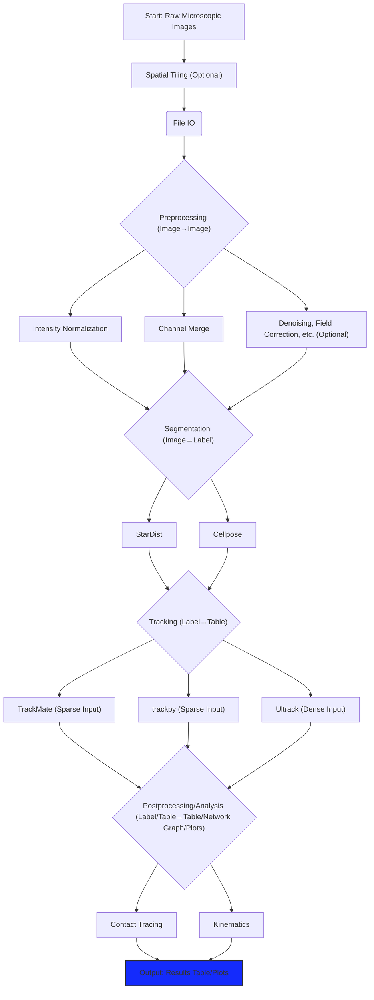

# pyCyto Analysis Pipeline

The following diagram illustrates the typical workflow stages within pyCyto:

```mermaid
graph TD
    A[Start: Raw Microscopic Images] --> AA[Spatial Tiling #40;Optional#41;]
    AA --> B(File IO);
    B --> C{Preprocessing #40;Image→Image#41;};
    C --> D[Intensity Normalization];
    C --> E[Channel Merge];
    C --> F[Denoising, Field Correction, etc. #40;Optional#41;];
    D & E & F --> G{Segmentation #40;Image→Label#41;};
    G --> H[StarDist];
    G --> I[Cellpose];
    H & I --> J{Tracking #40;Label→Table#41;};
    J --> K[TrackMate #40;Sparse Input#41;];
    J --> L[trackpy #40;Sparse Input#41;];
    J --> M[Ultrack #40;Dense Input#41;];
    K & L & M --> Q{Postprocessing/Analysis #40;Label/Table→Table/Network Graph/Plots#41;};
    Q --> N[Contact Tracing];
    Q --> O[Kinematics];
    N & O --> P[Output: Results Table/Plots];

    style P fill:#142bfc,stroke:#333,stroke-width:2px
```